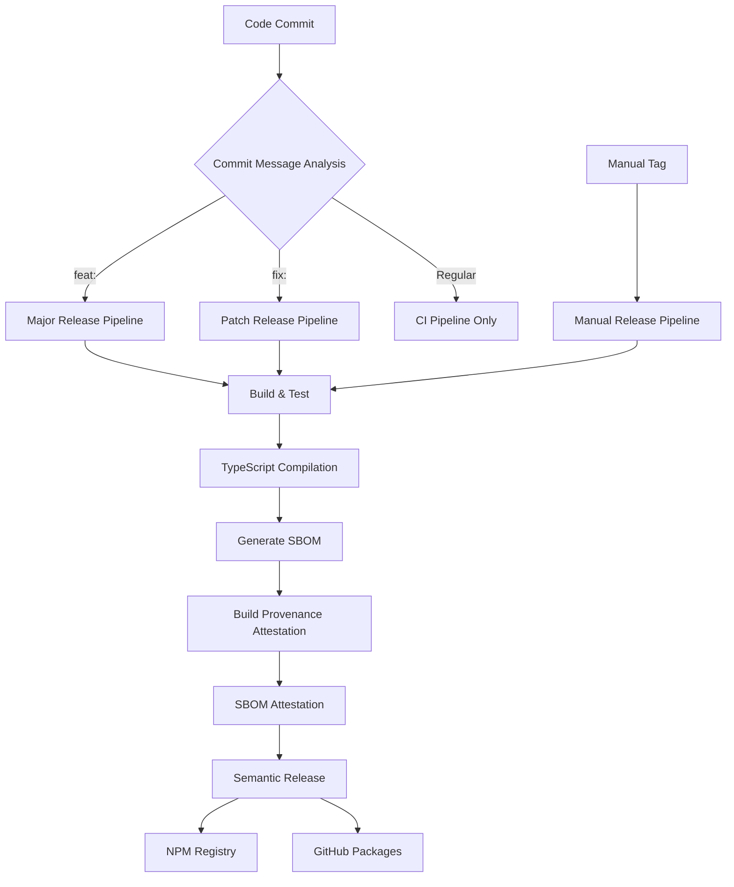

# Automated Development Workflow

## Overview

This MCP template implements a comprehensive automated development workflow that ensures code quality, security, and reliable publishing through multiple CI/CD pipelines. The workflow integrates build processes, security attestations, and multi-registry publishing with robust automation triggers.

## Architecture



## Code Quality Gate

### Pre-commit Hooks (Husky)

Automated quality checks run before every commit:

- **Lint Checking**: Biome linter validates code style and catches errors
- **Commit Message Validation**: Commitlint ensures conventional commit format
- **Test Execution**: Vitest runs unit tests with coverage requirements

```bash
# Triggered automatically on git commit
husky prepare
commitlint --edit
biome check .
yarn test
```

### Lint and Format Pipeline

The project uses Biome for both linting and formatting:

```bash
# Check for style and syntax issues
yarn lint

# Auto-fix issues where possible
yarn lint:fix

# Format code consistently
yarn format
```

**Configuration**: `/biome.json` defines rules for TypeScript, import sorting, and code style.

## Build Process

### TypeScript Compilation Pipeline

The build process transforms TypeScript source code into optimised JavaScript distribution files:

#### Build Configuration (`tsconfig.json`)

```json
{
  "compilerOptions": {
    "target": "ES2022",           // Modern JavaScript output
    "module": "ES2022",           // ES modules for tree-shaking
    "outDir": "./dist",           // Build output directory
    "rootDir": "./src",           // Source directory
    "declaration": true,          // Generate .d.ts files
    "declarationMap": true,       // Source maps for declarations
    "sourceMap": true,            // Debug source maps
    "strict": true                // Maximum type safety
  }
}
```

#### Build Artifacts and Outputs

The compilation produces several types of artifacts:

1. **JavaScript Files** (`*.js`): Compiled ES2022 modules
2. **Type Declarations** (`*.d.ts`): TypeScript type definitions
3. **Source Maps** (`*.map`): Debug mapping for development
4. **Declaration Maps**: TypeScript declaration source maps

```bash
# Build command
yarn build  # Equivalent to: tsc

# Output structure
dist/
├── index.js              # Main entry point
├── index.d.ts            # Type declarations
├── index.js.map          # Source map
├── tools/
│   ├── example.js
│   ├── example.d.ts
│   └── example.js.map
└── utils/
    ├── fetch.js
    ├── fetch.d.ts
    ├── validation.js
    └── validation.d.ts
```

#### Build Optimization

- **ES2022 Target**: Leverages modern JavaScript features for smaller bundle size
- **Tree Shaking**: ES modules enable dead code elimination
- **Strict TypeScript**: Catches errors at compile time
- **Source Maps**: Enable debugging in production environments

#### Development vs Production Builds

**Development Mode** (`yarn dev`):
- Uses `tsx` for TypeScript execution without compilation
- Hot reload with file watching
- Preserves full debugging information

**Production Mode** (`yarn build`):
- Full TypeScript compilation
- Optimised for distribution
- Generates all artifacts for publishing

### Package Distribution

Files included in the published package are controlled by the `files` field in `package.json`:

```json
{
  "files": [
    "dist/**/*.js",         # Compiled JavaScript
    "dist/**/*.d.ts",       # Type declarations
    "dist/**/*.map",        # Source maps
    "!dist/**/*.test.*",    # Exclude test files
    "LICENSE",              # License file
    "README.md",            # Documentation
    "CHANGELOG.md"          # Version history
  ]
}
```

## BOM (Bill of Materials) Attestation

### SBOM (Software Bill of Materials) Generation

The workflow automatically generates comprehensive Software Bill of Materials using Anchore's SBOM action:

```yaml
- name: Generate SBOM
  uses: anchore/sbom-action@v0
  with:
    format: spdx-json
    output-file: sbom.spdx.json
```

#### SBOM Contents

The generated SBOM includes:

1. **Package Information**: Name, version, description, license
2. **Dependencies**: Complete dependency tree with versions
3. **File Inventory**: All files included in the distribution
4. **Relationship Data**: How components relate to each other
5. **Security Metadata**: Known vulnerabilities and security attributes

#### SBOM Format

Uses **SPDX (Software Package Data Exchange)** format:
- Industry standard for software bill of materials
- JSON format for machine readability
- Comprehensive metadata schema
- Compatible with security scanning tools

### Build Provenance Attestation

GitHub's build provenance attestation creates cryptographic proof of the build process:

```yaml
- name: Attest Build Provenance
  uses: actions/attest-build-provenance@v1
  with:
    subject-path: |
      ./dist
      ./sbom.spdx.json
```

#### Provenance Information

The attestation captures:

1. **Build Environment**: Runner OS, architecture, environment variables
2. **Source Information**: Repository, commit SHA, branch
3. **Build Process**: Workflow definition, steps executed
4. **Timing Data**: Build start/end times
5. **Dependencies**: Tools and actions used in the build

#### Cryptographic Signatures

- **Sigstore Integration**: Uses Sigstore for keyless signing
- **OIDC Authentication**: GitHub's OIDC token provides identity
- **Transparency Log**: All signatures recorded in public transparency log
- **Verification**: Can be verified using `gh attestation verify`

### SBOM Attestation

Dedicated SBOM attestation links the software bill of materials to the built artifacts:

```yaml
- name: Attest SBOM
  uses: actions/attest-sbom@v1
  with:
    subject-path: './dist'
    sbom-path: './sbom.spdx.json'
```

#### Security Benefits

1. **Supply Chain Transparency**: Complete visibility into dependencies
2. **Vulnerability Tracking**: Link vulnerabilities to specific components
3. **Compliance**: Meets regulatory requirements for software transparency
4. **Integrity Verification**: Cryptographic proof of authenticity

#### Verification Process

```bash
# Verify build provenance
gh attestation verify <artifact> --owner mearman

# Verify SBOM attestation  
gh attestation verify <artifact> --owner mearman --type sbom
```

## Publishing Pipeline

### Multi-Registry Strategy

The template publishes to two registries for maximum availability and distribution:

#### 1. NPM Registry (Primary)

**Configuration** (`package.json`):
```json
{
  "publishConfig": {
    "access": "public",
    "registry": "https://registry.npmjs.org/",
    "provenance": true
  }
}
```

**Benefits**:
- **Global Distribution**: Worldwide CDN for fast package downloads
- **Package Discovery**: Searchable on npmjs.com
- **Community Standard**: Primary registry for Node.js packages
- **Provenance Support**: Built-in attestation support

#### 2. GitHub Packages (Secondary)

**Configuration**: Dynamic during workflow execution
```bash
# Update package name for GitHub Packages (must be scoped)
npm pkg set name="@mearman/mcp-template"

# Configure GitHub Packages registry
npm config set registry https://npm.pkg.github.com/

# Publish with provenance and access settings
npm publish --access public --provenance --ignore-scripts
```

**Benefits**:
- **Integrated Security**: Native GitHub security scanning
- **Access Control**: Fine-grained permissions using GitHub teams
- **Enterprise Ready**: Supports private registries for organizations
- **Git Integration**: Seamless integration with source code

### Registry Configuration and Authentication

#### NPM Registry
- **Authentication**: Not configured for security (publish disabled)
- **Access**: Public packages available globally
- **Provenance**: Automatically enabled for build attestations

#### GitHub Packages
- **Authentication**: Uses `GITHUB_TOKEN` for automatic authentication
- **Scope**: Packages must be scoped to the repository owner
- **Access**: Public packages available to all GitHub users
- **Provenance**: Supported through `--provenance` flag

### Package Distribution and Availability

#### Installation Methods

**From NPM Registry**:
```bash
npm install mcp-template
yarn add mcp-template
```

**From GitHub Packages**:
```bash
npm install @mearman/mcp-template --registry=https://npm.pkg.github.com
```

**Direct from Repository**:
```bash
npm install git+https://github.com/Mearman/mcp-template.git
```

#### Binary Distribution

The package includes a binary entry point for CLI usage:

```json
{
  "bin": "dist/index.js",
  "main": "dist/index.js"
}
```

Enables global installation and execution:
```bash
npm install -g mcp-template
mcp-template --help
```

## Automation Triggers and Conditions

### Semantic Release Pipeline

**Trigger**: Push to `main` branch
**Workflow**: `.github/workflows/semantic-release.yml`

#### Automatic Release Conditions

The semantic-release process analyzes commit messages to determine release type:

```bash
# Major release (breaking changes)
feat!: redesign API interface
BREAKING CHANGE: removed legacy endpoints

# Minor release (new features)
feat: add new validation tool
feat(tools): implement caching mechanism

# Patch release (bug fixes)
fix: resolve memory leak in fetch utility
fix(validation): handle edge case in URL parsing

# No release (documentation, etc.)
docs: update README.md
chore: update dependencies
```

#### Release Process Flow

1. **Version Analysis**: Determine next version based on commits
2. **Changelog Generation**: Update `CHANGELOG.md` with release notes
3. **Version Bump**: Update `package.json` version
4. **Git Tag**: Create annotated git tag
5. **GitHub Release**: Create release with generated notes
6. **Build Process**: Compile TypeScript and run tests
7. **SBOM Generation**: Create software bill of materials
8. **Attestation**: Generate build provenance and SBOM attestations
9. **NPM Publish**: Publish to npm registry (when configured)
10. **GitHub Packages**: Publish to GitHub Packages registry

#### Skip Conditions

```bash
# Skip CI entirely
git commit -m "docs: update README [skip ci]"

# The workflow includes automatic skip detection
if: "!contains(github.event.head_commit.message, '[skip ci]')"
```

### Manual Release Pipeline

**Trigger**: Git tag matching `v*` pattern
**Workflow**: `.github/workflows/release.yml`

#### Manual Release Process

```bash
# Create and push tag for manual release
git tag v1.2.3
git push origin v1.2.3
```

#### Differences from Automatic Pipeline

1. **No Version Management**: Uses existing tag, doesn't modify `package.json`
2. **Changelog Extraction**: Parses existing `CHANGELOG.md` for release notes
3. **Full Security Process**: Same SBOM and attestation process
4. **Manual Trigger**: Requires explicit tag creation

### Security Measures in Publishing Pipeline

#### Permission Controls

**GitHub Actions Permissions**:
```yaml
permissions:
  contents: write        # Create releases and tags
  packages: write        # Publish to GitHub Packages
  id-token: write        # Generate OIDC tokens for attestation
  attestations: write    # Create security attestations
  issues: write          # Update issues for releases
  pull-requests: write   # Update PRs for releases
```

#### Authentication Security

1. **GITHUB_TOKEN**: Automatically provided, scoped to repository
2. **NPM_TOKEN**: Intentionally disabled to prevent accidental publishing
3. **OIDC Tokens**: Short-lived tokens for cryptographic operations
4. **Sigstore**: Keyless signing using OIDC identity

#### Build Security

1. **Immutable Dependencies**: `yarn install --immutable`
2. **Test Requirements**: All tests must pass before publishing
3. **Script Restrictions**: `--ignore-scripts` prevents malicious package scripts
4. **Provenance Generation**: Cryptographic proof of build integrity

#### Supply Chain Protection

1. **SBOM Generation**: Complete dependency transparency
2. **Attestation Signatures**: Tamper-evident build artifacts
3. **Public Transparency**: All signatures logged publicly
4. **Verification Tools**: Enable downstream verification

## Integration with Existing Systems

### Commitlint Integration

**Configuration** (`commitlint.config.js`):
```javascript
export default {
  extends: ['@commitlint/config-conventional'],
  rules: {
    'type-enum': [2, 'always', [
      'feat', 'fix', 'docs', 'style', 'refactor', 
      'test', 'chore', 'revert', 'ci', 'build'
    ]]
  }
};
```

### Husky Pre-commit Hooks

**Setup**: Automatic installation with `yarn prepare`
**Integration**: Links to commitlint and quality checks

### Semantic Release Configuration

The semantic-release process is configured through package.json and uses these plugins:

1. **@semantic-release/commit-analyzer**: Analyze commits for release type
2. **@semantic-release/release-notes-generator**: Generate changelog content
3. **@semantic-release/changelog**: Update CHANGELOG.md file
4. **@semantic-release/npm**: Publish to npm registry
5. **@semantic-release/github**: Create GitHub releases
6. **@semantic-release/git**: Commit version changes

## Monitoring and Observability

### Build Status Tracking

- **GitHub Actions Status**: Visible in repository badge
- **Test Coverage**: Generated by Vitest with c8
- **Release Status**: Tracked through GitHub releases
- **Package Availability**: Monitored across registries

### Security Monitoring

- **SBOM Analysis**: Automatic vulnerability scanning
- **Attestation Verification**: Continuous integrity checking
- **Dependency Updates**: Automated through Dependabot
- **Security Advisories**: GitHub security alerts

### Performance Metrics

- **Build Time**: Tracked in GitHub Actions
- **Package Size**: Monitored through bundle analysis
- **Test Coverage**: Maintained above 80% threshold
- **Distribution Speed**: CDN performance across registries

## Troubleshooting

### Common Issues

#### Build Failures
```bash
# TypeScript compilation errors
yarn build
# Check tsconfig.json configuration

# Test failures
yarn test
# Review failing test cases
```

#### Publishing Issues
```bash
# Registry authentication
npm whoami --registry=https://registry.npmjs.org/
npm whoami --registry=https://npm.pkg.github.com/

# Package configuration
npm config list
```

#### Attestation Problems
```bash
# Verify existing attestations
gh attestation verify <package> --owner <owner>

# Check workflow permissions
# Ensure id-token: write is set
```

### Debug Mode

```bash
# Enable debug output for npm
DEBUG=* npm publish

# GitHub Actions debug
# Set repository secret: ACTIONS_STEP_DEBUG=true
```

## Best Practices

### Commit Message Guidelines

```bash
# Feature additions
feat(scope): add new functionality
feat: implement user authentication

# Bug fixes  
fix(scope): resolve specific issue
fix: handle null pointer exception

# Breaking changes
feat!: redesign API structure
fix!: remove deprecated methods
```

### Release Planning

1. **Feature Branches**: Develop features in separate branches
2. **Commit Squashing**: Squash related commits before merging
3. **Pre-release Testing**: Use pre-release tags for testing
4. **Documentation Updates**: Include docs in the same PR as features

### Security Practices

1. **Regular Updates**: Keep dependencies current
2. **Audit Scanning**: Run `npm audit` regularly
3. **Permission Minimization**: Use least-privilege principles
4. **Attestation Verification**: Verify packages before deployment

This comprehensive workflow ensures high-quality, secure, and reliable package distribution while maintaining developer productivity and automation efficiency.